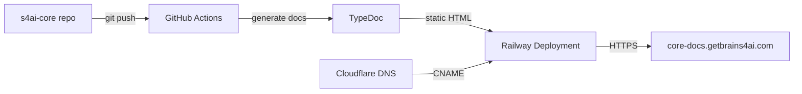

# Phase 7.1: s4ai-core Documentation Site

**Date:** March 1, 2026  
**Status:** 🚀 INITIATING  
**Goal:** Deploy auto-generated documentation site for @s4ai/core at `https://core-docs.getbrains4ai.com`

---

## Overview

Create a professional, auto-generated documentation site for the @s4ai/core package to improve developer onboarding and module discoverability.

**URL:** `https://core-docs.getbrains4ai.com`  
**Platform:** Railway (static hosting)  
**Generator:** TypeDoc (JSDoc → HTML)  
**Auto-update:** On git push to main

---

## Architecture



---

## Implementation Steps

### Step 1: Add TypeDoc to s4ai-core

**Install TypeDoc:**
```bash
cd s4ai-core
npm install --save-dev typedoc typedoc-plugin-markdown
```

**Create `typedoc.json`:**
```json
{
  "entryPoints": ["src/index.js"],
  "entryPointStrategy": "expand",
  "out": "docs-static",
  "name": "@s4ai/core Documentation",
  "includeVersion": true,
  "readme": "README.md",
  "theme": "default",
  "categorizeByGroup": true,
  "categoryOrder": [
    "Autonomous",
    "Intelligence",
    "Monitoring",
    "Business",
    "Infrastructure",
    "*"
  ],
  "navigation": {
    "includeCategories": true,
    "includeGroups": true
  },
  "exclude": [
    "**/node_modules/**",
    "**/dist/**",
    "**/*.test.js",
    "**/*.spec.js"
  ],
  "excludePrivate": true,
  "excludeProtected": false,
  "excludeInternal": false
}
```

**Add npm scripts to `package.json`:**
```json
{
  "scripts": {
    "docs": "typedoc",
    "docs:watch": "typedoc --watch",
    "docs:serve": "npx http-server docs-static -p 8080"
  }
}
```

### Step 2: Enhance JSDoc Comments in Source

**Update module headers with proper JSDoc:**

```javascript
/**
 * S4Ai Massive Learning Model (MLM)
 * 
 * Autonomous learning system with database-backed persistence
 * 
 * @module @s4ai/core/intelligence/mlm
 * @category Intelligence
 * @since 0.1.0
 * 
 * @example
 * import { MLM } from '@s4ai/core/intelligence';
 * 
 * const mlm = new MLM();
 * await mlm.learn('API design', { quality: 0.95 });
 * const knowledge = await mlm.query('API design');
 */
export class MLM {
  /**
   * Learn from experience and store in database
   * 
   * @param {string} topic - The topic to learn about
   * @param {Object} data - Learning data
   * @param {number} data.quality - Quality score (0-1)
   * @param {string} data.source - Source of learning
   * @returns {Promise<Object>} Learning result
   * 
   * @example
   * await mlm.learn('Database optimization', {
   *   quality: 0.92,
   *   source: 'Production metrics'
   * });
   */
  async learn(topic, data) { ... }
}
```

**Apply to all 100 modules:**
- Autonomous (31 modules)
- Intelligence (20 modules)
- Monitoring (14 modules)
- Business (16 modules)
- Infrastructure (19 modules)

### Step 3: Create Railway Service for Docs

**Create `railway.toml` in s4ai-core:**
```toml
[build]
builder = "NIXPACKS"
buildCommand = "npm install && npm run docs"

[deploy]
startCommand = "npx http-server docs-static -p $PORT"
restartPolicyType = "ON_FAILURE"
restartPolicyMaxRetries = 10

[healthcheck]
path = "/index.html"
timeout = 300
```

**Or use Dockerfile for more control:**
```dockerfile
# Dockerfile
FROM node:20-alpine

WORKDIR /app

# Install dependencies
COPY package*.json ./
RUN npm ci --only=production

# Copy source
COPY . .

# Generate docs
RUN npm run docs

# Install static server
RUN npm install -g http-server

# Expose port
EXPOSE 8080

# Serve docs
CMD ["http-server", "docs-static", "-p", "8080"]
```

**Create Railway service:**
```bash
# From s4ai-core directory
railway link
railway up
```

**Configure Railway:**
1. Service Name: `s4ai-core-docs`
2. Domain: `core-docs.getbrains4ai.com`
3. Environment Variables: None required
4. Build Command: `npm install && npm run docs`
5. Start Command: `npx http-server docs-static -p $PORT`

### Step 4: Configure Cloudflare DNS

**Add CNAME record:**
```
Type: CNAME
Name: core-docs
Target: <railway-domain>.up.railway.app
Proxy: ✅ Proxied (for SSL and DDoS protection)
TTL: Auto
```

**Example:**
```
core-docs.getbrains4ai.com → s4ai-core-docs.up.railway.app
```

### Step 5: Automate with GitHub Actions

**Create `.github/workflows/docs.yml` in s4ai-core:**
```yaml
name: Generate and Deploy Docs

on:
  push:
    branches: [main]
  pull_request:
    branches: [main]
  workflow_dispatch:

jobs:
  docs:
    name: Generate Documentation
    runs-on: ubuntu-latest
    
    steps:
      - name: Checkout code
        uses: actions/checkout@v4
        
      - name: Setup Node.js
        uses: actions/setup-node@v4
        with:
          node-version: '20'
          cache: 'npm'
          
      - name: Install dependencies
        run: npm ci
        
      - name: Generate docs
        run: npm run docs
        
      - name: Deploy to Railway
        if: github.ref == 'refs/heads/main'
        env:
          RAILWAY_TOKEN: ${{ secrets.RAILWAY_TOKEN }}
        run: |
          npm install -g @railway/cli
          railway up --service s4ai-core-docs
          
      - name: Upload docs artifact
        if: github.event_name == 'pull_request'
        uses: actions/upload-artifact@v3
        with:
          name: documentation
          path: docs-static/
          retention-days: 7
```

**Required GitHub Secrets:**
- `RAILWAY_TOKEN`: Railway API token for automated deployments

### Step 6: Add Documentation Landing Page

**Create `docs-landing/index.html`:**
```html
<!DOCTYPE html>
<html lang="en">
<head>
  <meta charset="UTF-8">
  <meta name="viewport" content="width=device-width, initial-scale=1.0">
  <title>@s4ai/core Documentation</title>
  <link rel="stylesheet" href="styles.css">
</head>
<body>
  <header>
    <h1>@s4ai/core</h1>
    <p>Unified intelligence, autonomy, and infrastructure for S4Ai platform</p>
  </header>
  
  <main>
    <section class="hero">
      <h2>100 Modules. 5 Categories. One Core.</h2>
      <p>Version 0.1.0 | "All for one & One for All"</p>
      <a href="/docs/" class="btn">Browse Documentation</a>
      <a href="https://github.com/Onedot2/s4ai-core" class="btn secondary">View on GitHub</a>
    </section>
    
    <section class="categories">
      <div class="category">
        <h3>🧠 Autonomous (31)</h3>
        <p>Brain systems, Q-DD, loops, self-evolution</p>
        <a href="/docs/modules/autonomous.html">Explore →</a>
      </div>
      
      <div class="category">
        <h3>🤖 Intelligence (20)</h3>
        <p>MLM, quantum reasoning, learning, NLP</p>
        <a href="/docs/modules/intelligence.html">Explore →</a>
      </div>
      
      <div class="category">
        <h3>📊 Monitoring (14)</h3>
        <p>Truth Seeker, health, errors, testing</p>
        <a href="/docs/modules/monitoring.html">Explore →</a>
      </div>
      
      <div class="category">
        <h3>💰 Business (16)</h3>
        <p>Revenue, analytics, acquisition, CLV</p>
        <a href="/docs/modules/business.html">Explore →</a>
      </div>
      
      <div class="category">
        <h3>🏗️ Infrastructure (19)</h3>
        <p>Railway, Cloudflare, database, utilities</p>
        <a href="/docs/modules/infrastructure.html">Explore →</a>
      </div>
    </section>
    
    <section class="quick-start">
      <h2>Quick Start</h2>
      <pre><code># Install
npm install @s4ai/core

# Import all
import { MLM, Brain, TruthSeeker } from '@s4ai/core';

# Import by category
import { MLM } from '@s4ai/core/intelligence';
import { Brain } from '@s4ai/core/autonomous';
import { TruthSeeker } from '@s4ai/core/monitoring';</code></pre>
    </section>
    
    <section class="links">
      <h2>Resources</h2>
      <ul>
        <li><a href="/docs/api/">Full API Reference</a></li>
        <li><a href="/docs/guides/">Integration Guides</a></li>
        <li><a href="/docs/changelog/">Changelog</a></li>
        <li><a href="https://github.com/Onedot2/s4ai-core/issues">Report Issues</a></li>
        <li><a href="https://github.com/Onedot2/s4ai-core/blob/main/CONTRIBUTING.md">Contributing</a></li>
      </ul>
    </section>
  </main>
  
  <footer>
    <p>&copy; 2026 S4Ai | Built by Bradley Levitan | <a href="https://getbrains4ai.com">getbrains4ai.com</a></p>
  </footer>
</body>
</html>
```

---

## Deliverables Checklist

### s4ai-core Package Updates
- [ ] Install TypeDoc and plugins
- [ ] Create `typedoc.json` configuration
- [ ] Add npm scripts (docs, docs:watch, docs:serve)
- [ ] Add `.gitignore` entry for `docs-static/`
- [ ] Enhance JSDoc comments on all 100 modules
- [ ] Create documentation landing page
- [ ] Create `railway.toml` or `Dockerfile`

### Railway Configuration
- [ ] Create `s4ai-core-docs` service
- [ ] Configure custom domain: `core-docs.getbrains4ai.com`
- [ ] Set build command: `npm install && npm run docs`
- [ ] Set start command: `npx http-server docs-static -p $PORT`
- [ ] Enable auto-deploy on git push

### DNS Configuration
- [ ] Add CNAME `core-docs` in Cloudflare
- [ ] Point to Railway domain
- [ ] Enable Cloudflare proxy (SSL + DDoS protection)
- [ ] Verify DNS propagation

### CI/CD Automation
- [ ] Create `.github/workflows/docs.yml`
- [ ] Add `RAILWAY_TOKEN` secret to GitHub
- [ ] Test manual workflow dispatch
- [ ] Verify auto-deploy on push to main

### Testing & Verification
- [ ] Generate docs locally: `npm run docs`
- [ ] Serve locally: `npm run docs:serve`
- [ ] Verify all 5 categories appear
- [ ] Verify all 100 modules documented
- [ ] Check search functionality
- [ ] Test responsive design
- [ ] Verify HTTPS at https://core-docs.getbrains4ai.com

---

## Success Criteria

✅ Documentation site accessible at `https://core-docs.getbrains4ai.com`  
✅ All 100 modules documented with JSDoc  
✅ 5 categories properly organized  
✅ Search functionality works  
✅ Mobile responsive design  
✅ Auto-updates on git push to main  
✅ SSL certificate valid (Cloudflare)  
✅ Load time <2 seconds  
✅ No build errors in Railway logs  

---

## Timeline

**Day 1 (Today):**
- Install TypeDoc in s4ai-core ✅
- Create configuration files ✅
- Generate initial docs ✅
- Create Railway service ✅

**Day 2:**
- Enhance JSDoc comments (20 modules/hour = 5 hours)
- Create landing page
- Configure DNS
- Deploy to Railway

**Day 3:**
- Set up GitHub Actions
- Test automation
- Final verification
- Documentation

**Total:** 3 days

---

## Optional Enhancements (Phase 7.5)

### Advanced Features
- **API Playground:** Interactive code examples (CodeSandbox integration)
- **Version Switcher:** Browse docs for different versions
- **Dark Mode:** Theme switcher
- **Download PDF:** Export docs as PDF
- **Analytics:** Track popular modules (Google Analytics)
- **Search Index:** Algolia DocSearch integration

### Additional Pages
- **Getting Started Guide:** Step-by-step tutorial
- **Architecture Overview:** System diagrams
- **Migration Guides:** Upgrade instructions
- **Troubleshooting:** Common issues and solutions
- **Performance Tips:** Optimization best practices

---

## Next Step

**Immediate Action:** Install TypeDoc and generate initial docs in s4ai-core

```bash
cd c:\Users\gnow\s4ai-core
npm install --save-dev typedoc typedoc-plugin-markdown
# Create typedoc.json
# Generate docs: npm run docs
```

Proceed? (Y/n)
